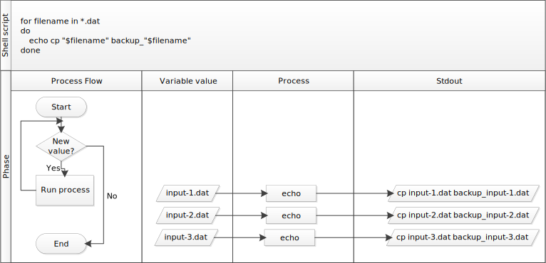

### Eine Schleife schreiben

**Schleifen** sind der Schlüssel zur Produktivitätssteigerung durch Automatisierung, da sie es uns ermöglichen
Befehle wiederholend auszuführen. Ähnlich wie bei Platzhaltern und der Tabulatorvervollständigung reduziert das Verwenden von Schleifen auch die
Tipparbeit (und Tippfehler).
Nehmen wir an, wir haben mehrere hundert Dokumentendateien mit den Namen "projekt_1825.txt", "projekt_1863.txt", "XML_projekt.txt" und so weiter.
Wir möchten diese Dateien ändern, aber auch eine Version der Originaldateien speichern und die Kopien so benennen
Backup_Projekt_1825.txt" und so weiter.

Dazu können wir eine **Schleife** verwenden.
Hier ist ein einfaches Beispiel, das nacheinander eine Sicherungskopie von vier Textdateien erstellt.

Erzeugen wir zuerst diese Dateien:

~~~
$ touch a.txt b.txt c.txt d.txt
~~~
Dadurch werden vier leere Dateien mit diesen Namen erstellt.

Jetzt verwenden wir eine Schleife, um eine Backup-Version dieser Dateien zu erstellen. Suchen wir zunächst die allgemeine Form einer Schleife:

```
for thing in list_of_things
do
    operation_using $thing # Eine Einrückung innerhalb der Schleife ist nicht erforderlich, dient aber der Lesbarkeit
done
```
{: .language-bash}

Wir können das auf unser Beispiel wie folgt anwenden:


~~~
$ for filename in ?.txt
> do
> echo "$Dateiname"
> cp "$Dateiname" backup_"$Dateiname"
> done
~~~
{: .bash}

~~~
a.txt
b.txt
c.txt
d.txt
~~~
{: .output}

Wenn die Shell das Schlüsselwort `for` sieht,
weiß sie, dass sie einen Befehl (oder eine Gruppe von Befehlen) für jedes Ding in einer Liste einmal wiederholen muss.
Bei jeder Wiederholung
wird der Name jedes Dings der Reihe nach der
der **Schleifenvariablen** zugewiesen und die Befehle innerhalb der Schleife werden ausgeführt, bevor sie zum nächsten Punkt in der Liste weitergehen.
der nächsten Sache in der Liste.
Innerhalb der Schleife,
fordern wir den Wert der Variablen an, indem wir "$" vor die Variable setzen.
Das "$" sagt dem Shell-Interpreter, dass er die
die **Variable** wie einen Variablennamen zu behandeln und ihren Wert an ihrer Stelle zu ersetzen,
anstatt sie als Text oder externen Befehl zu behandeln.

> ## Doppelte Anführungszeichen für Variablenersetzungen
>
> Weil Dateinamen in der realen Welt oft Leerzeichen enthalten,
> verpacken wir "$Dateiname" in doppelte Anführungszeichen (`"`). Wenn wir das nicht täten, würde die
> würde die Shell das Leerzeichen innerhalb eines Dateinamens als Trennzeichen
> zwischen zwei verschiedenen Dateinamen behandeln, was normalerweise zu Fehlern führt.
> Deshalb ist es am besten und generell sicherer, `"$..."` zu verwenden, außer
> du absolut sicher bist, dass keine Elemente mit Leerzeichen jemals
> in deine Schleifenvariable kommen (wie in [Folge 5]({{ page.root }}/05-counting-mining/index.html#using-a-loop-to-count-words)).
{: .callout}

In diesem Beispiel besteht die Liste aus vier Dateinamen: 'a.txt', 'b.txt', 'c.txt', und 'd.txt'
Jedes Mal, wenn die Schleife durchläuft, weist sie der Variablen `Dateiname` einen Dateinamen zu
und führt den Befehl "cp" aus.
Das erste Mal, wenn die Schleife durchlaufen wird,
ist "$Dateiname" "a.txt".
Der Interpreter gibt den Dateinamen auf dem Bildschirm aus und führt dann den Befehl "cp" für "a.txt" aus (weil wir ihn gebeten haben, jeden Dateinamen beim Durchlaufen der Schleife auszugeben).
Bei der zweiten Iteration wird "$Dateiname" zu
b.txt". Dieses Mal gibt die Shell den Dateinamen "b.txt" auf dem Bildschirm aus und führt dann "cp" für "b.txt" aus. Die Schleife führt die gleichen Operationen für `c.txt` und dann für `d.txt` durch und dann, da
Da die Liste nur diese vier Einträge enthielt, verlässt die Shell die "for"-Schleife an diesem Punkt.

> ## Folge der Eingabeaufforderung
>
> Die Eingabeaufforderung wechselt von "$" zu ">" und wieder zurück, während wir
> Tippen in unserer Schleife. Der zweite Prompt, `>`, ist anders, um uns daran zu erinnern
> uns daran zu erinnern, dass wir noch nicht mit der Eingabe eines vollständigen Befehls fertig sind. Ein Semikolon, `;`,
> kann verwendet werden, um zwei Befehle, die in einer Zeile stehen, zu trennen.
{: .callout}

> ## Gleiche Symbole, unterschiedliche Bedeutungen
>
> Hier sehen wir, dass `>` als Shell-Prompt verwendet wird, aber `>` kann auch
> verwendet werden, um die Ausgabe eines Befehls umzuleiten (d.h. sie an einen anderen Ort zu schicken, z.B. in eine Datei, anstatt sie im Terminal anzuzeigen) --- > wir verwenden die Umleitung
> Wir verwenden die Umleitung in [Episode 5]({{ page.root }}).
> In ähnlicher Weise wird `$` als Shell-Prompt verwendet, aber, wie wir bereits gesehen haben,
> wird es auch verwendet, um die Shell aufzufordern, den Wert einer Variablen zu ermitteln.
>
> Wenn die *Shell* `>` oder `$` ausgibt, erwartet sie, dass du etwas eingibst,
> und das Symbol ist ein Prompt.
>
> Wenn *du* selbst `>` oder `$` tippst, ist es eine Anweisung von dir, dass
> die Shell auffordert, die Ausgabe umzuleiten oder den Wert einer Variablen abzurufen.
{: .callout}

Wir haben die Variable in dieser Schleife `Dateiname` genannt
genannt, um ihren Zweck für menschliche Leser zu verdeutlichen.
Der Shell selbst ist es egal, wie die Variable genannt wird.

> ## For-Schleife Übung
> Fülle die Leerzeichen in der folgenden for-Schleife aus, um den Namen, die erste Zeile und die letzte Zeile
> jeder Textdatei im aktuellen Verzeichnis ausgeben.
>
> ```
> ___ Datei in *.txt
> __
> echo "_datei"
> head -n 1 _______
> ____ __ _ _______
> ____
> ```
> {: .bash}
>
> > ## Lösung
> > ```
> > for file in *.txt
> > do
> > echo "$file"
> > head -n 1 "$Datei"
> > tail -n 1 "$Datei" > > tail -n 1 "$Datei"
> > done
> > ```
> > {: .bash}
> {: .solution}
{: .challenge}

Dies ist unser erster Blick auf Schleifen. Wir werden eine weitere Schleife in der
[Counting and Mining with the Shell]({{ page.root }}) Episode.



> ## Ausführen der Schleife über ein Bash-Skript
>
> Alternativ kannst du die Schleife auch in einer Skriptdatei 
> kannst du sie auch in einer Skriptdatei speichern und von der Kommandozeile aus ausführen, ohne dass du
> die Schleife erneut schreiben musst. Das ist ein so genanntes Bash-Skript, eine einfache Textdatei, die 
> eine Reihe von Befehlen enthält, wie die Schleife, die du oben erstellt hast. In dem Beispielskript unten, 
> enthält die erste Zeile der Datei ein so genanntes Shebang (`#!`), gefolgt von dem Pfad zum Interpreter 
> (oder Programm), der die restlichen Zeilen der Datei ausführt (`/bin/bash`). Die zweite Zeile zeigt, wie 
> Kommentare in Skripten gemacht werden. Dadurch erhältst du mehr Informationen darüber, was das Skript macht. 
> Die restlichen Zeilen enthalten die Schleife, die du oben erstellt hast. Du kannst diese Datei in demselben Verzeichnis erstellen 
Du kannst diese Datei in demselben Verzeichnis > erstellen, das du für die Lektion verwendet hast, und einen Texteditor deiner Wahl verwenden (z. B. nano). 
> Wenn du die Datei speicherst, musst du darauf achten, dass sie die Endung **.sh** hat (z. B. "mein_erster_bash_script.sh"). Wenn du das getan hast, kannst du das
> Bash-Skript ausführen, indem du den Befehl bash und den Dateinamen in die Kommandozeile eingibst (z.B. `bash my_first_bash_script.sh`). 
> > ```
> > #!/bin/bash
> > # Dieses Skript durchläuft .txt-Dateien und gibt den Dateinamen, die erste und die letzte Zeile der Datei zurück
> > for file in *.txt
> > do
> > echo $file
> > head -n 1 $file
> > tail -n 1 $Datei
> > done
> > ```
> > {: .bash}
> Lade/kopiere [my_first_bash_script.sh](https://raw.githubusercontent.com/LibraryCarpentry/lc-shell/gh-pages/files/my_first_bash_script.sh). Mehr über Bash-Skripte erfährst du im [Bash Scripting Tutorial - Ryans Tutorials](https://ryanstutorials.net/bash-scripting-tutorial/).
{: .callout}
